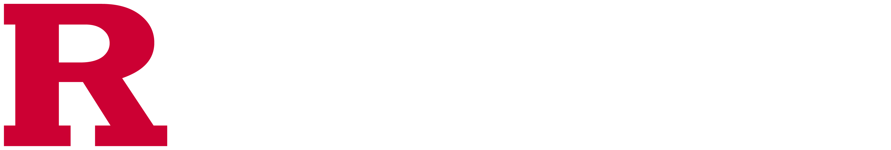

)

<ul>
<li> I'm currently a second-year at   </li>
</ul>

I'm a sophomore at Rutgers University. I study Math and Computer Science. I'm mainly interested in Algorithms Research and, generally, Theoretical Computer Science. 
This GitHub is full of classwork, projects, and notes.

<h3 align="left">Socials:</h3>

<!---
rakdcolon/rakdcolon is a ✨ special ✨ repository because its `README.md` (this file) appears on your GitHub profile.
You can click the Preview link to take a look at your changes.
--->
